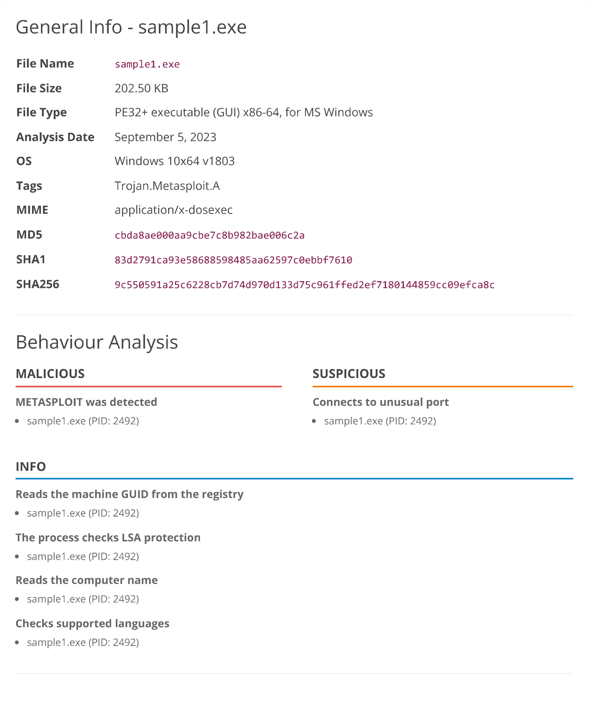
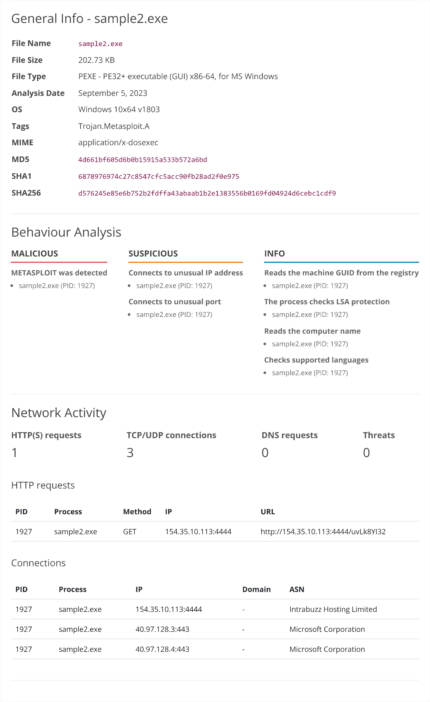
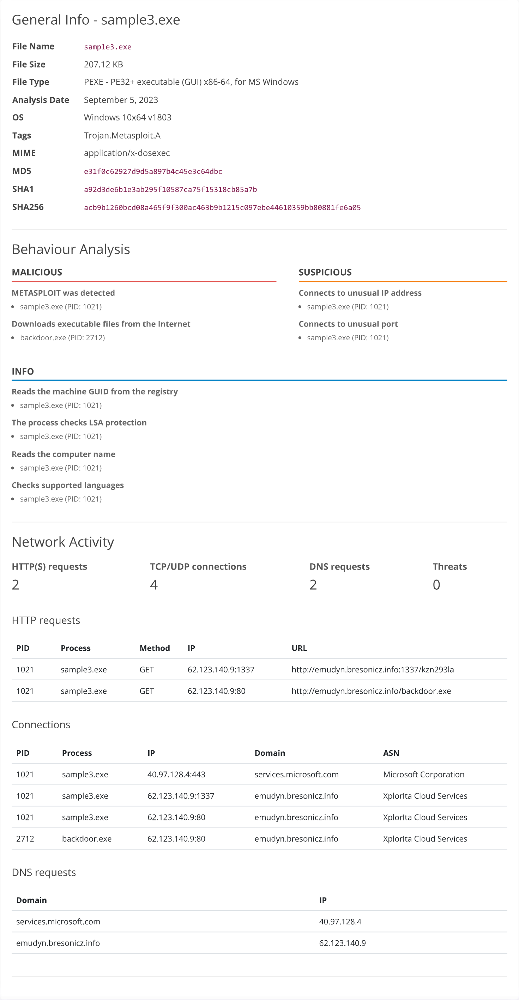
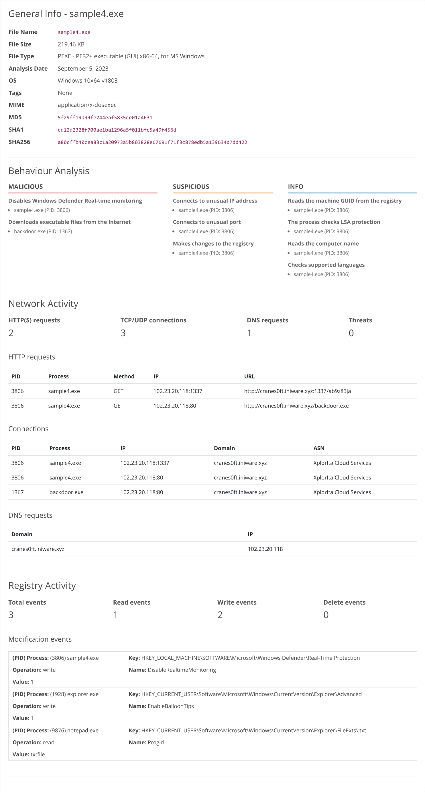
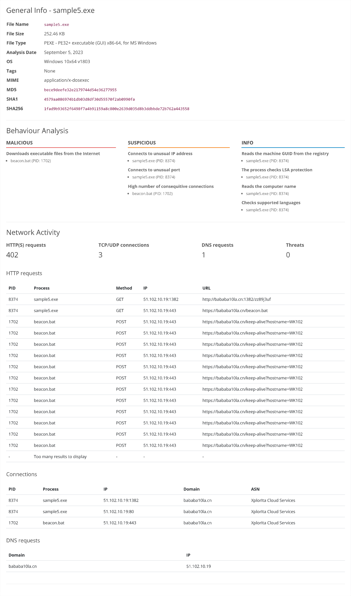
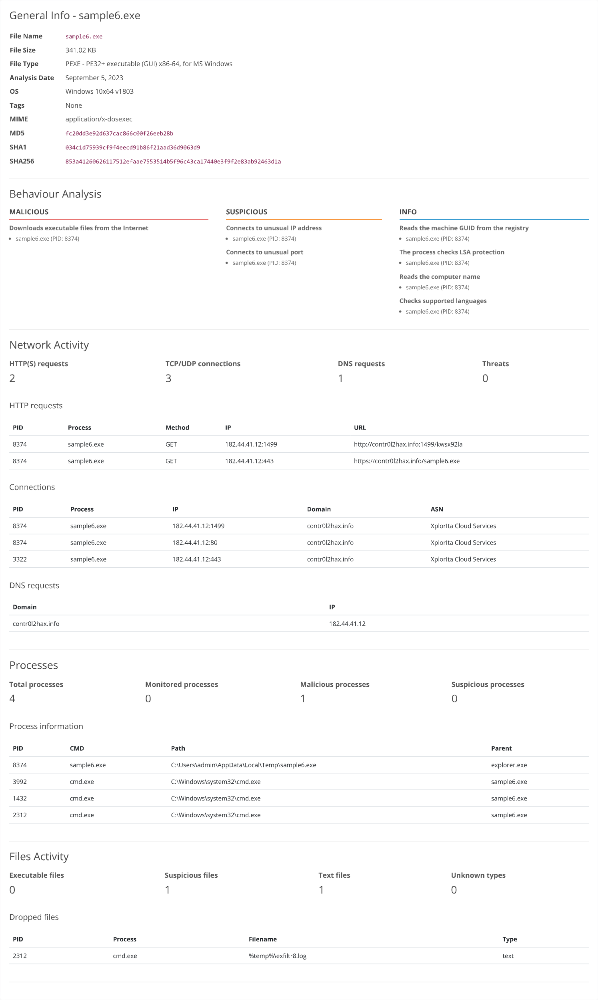

# [TryHackMe | Summit](https://tryhackme.com/room/summit) Challenge Room Solution Writeup

## What is the first flag you receive after successfully detecting sample1.exe?

Scan `sample1.exe` in the Malware Sandbox to get this analysis report.



Itentify any of the three hashes, then blocklist it in Manage Hashes.
    
```bash
MD5     cbda8ae000aa9cbe7c8b982bae006c2a
SHA1    83d2791ca93e58688598485aa62597c0ebbf7610
SHA256  9c550591a25c6228cb7d74d970d133d75c961ffed2ef7180144859cc09efca8c
```

Doing so will grant you the flag **THM{f3cbf08151a11a6a331db9c6cf5f4fe4}**.

## What is the second flag you receive after successfully detecting sample2.exe?

Scan `sample2.exe` in the Malware Sandbox to get this analysis report.



Identify the IP address used to `GET` the malware, then create the rule `Egress Any 154.35.10.113 Deny` in Firewall Manager. 

Doing so will grant you the flag **THM{2ff48a3421a938b388418be273f4806d}**.

## What is the third flag you receive after successfully detecting sample3.exe?

Scan `sample3.exe` in the Malware Sandbox to get this analysis report.



Identify the domain used to `GET` the malware, then create the rule `Malware hosting site Malware emudyn.bresonicz.info Deny` in DNS Filter. 

Doing so will grant you the flag **THM{4eca9e2f61a19ecd5df34c788e7dce16}**.

## What is the fourth flag you receive after successfully detecting sample4.exe?

Scan `sample4.exe` in the Malware Sandbox to get this analysis report.



Identify the modification event which begins Defense Evasion (Stealth), then create the below rule in the Sigma Rule Builder.

```bash
title: Modification of Windows Defender Real-Time Protection
id: windows_registry_defender_disable_realtime
description: |
  Detects modifications or creations of the Windows Defender Real-Time Protection DisableRealtimeMonitoring registry value.

references:
  - https://attack.mitre.org/tactics/TA0005/

tags:
  - attack.ta0005
  - sysmon

detection:
  selection:
    EventID: 4663
    ObjectType: Key
    ObjectName: 'HKEY_LOCAL_MACHINE\SOFTWARE\Microsoft\Windows Defender\Real-Time Protection'
    NewValue: 'DisableRealtimeMonitoring=1'

  condition: selection

falsepositives:
  - Legitimate changes to Windows Defender settings.

level: high
```

Doing so will grant you the flag **THM{c956f455fc076aea829799c0876ee399}**.

## What is the fifth flag you receive after successfully detecting sample5.exe?

Scan `sample5.exe` in the Malware Sandbox to get this analysis report.



Additionally view the `outgoing_connections.log` attached in this step's email.

``` bash
2023-08-15 09:00:00 | Source: 10.10.15.12 | Destination: 51.102.10.19 | Port: 443 | Size: 97 bytes
2023-08-15 09:23:45 | Source: 10.10.15.12 | Destination: 43.10.65.115 | Port: 443 | Size: 21541 bytes
2023-08-15 09:30:00 | Source: 10.10.15.12 | Destination: 51.102.10.19 | Port: 443 | Size: 97 bytes
2023-08-15 10:00:00 | Source: 10.10.15.12 | Destination: 51.102.10.19 | Port: 443 | Size: 97 bytes
2023-08-15 10:14:21 | Source: 10.10.15.12 | Destination: 87.32.56.124 | Port: 80  | Size: 1204 bytes
2023-08-15 10:30:00 | Source: 10.10.15.12 | Destination: 51.102.10.19 | Port: 443 | Size: 97 bytes
2023-08-15 11:00:00 | Source: 10.10.15.12 | Destination: 51.102.10.19 | Port: 443 | Size: 97 bytes
2023-08-15 11:30:00 | Source: 10.10.15.12 | Destination: 51.102.10.19 | Port: 443 | Size: 97 bytes
2023-08-15 11:45:09 | Source: 10.10.15.12 | Destination: 145.78.90.33 | Port: 443 | Size: 805 bytes
2023-08-15 12:00:00 | Source: 10.10.15.12 | Destination: 51.102.10.19 | Port: 443 | Size: 97 bytes
2023-08-15 12:30:00 | Source: 10.10.15.12 | Destination: 51.102.10.19 | Port: 443 | Size: 97 bytes
2023-08-15 13:00:00 | Source: 10.10.15.12 | Destination: 51.102.10.19 | Port: 443 | Size: 97 bytes
2023-08-15 13:30:00 | Source: 10.10.15.12 | Destination: 51.102.10.19 | Port: 443 | Size: 97 bytes
2023-08-15 13:32:17 | Source: 10.10.15.12 | Destination: 72.15.61.98  | Port: 443 | Size: 26084 bytes
2023-08-15 14:00:00 | Source: 10.10.15.12 | Destination: 51.102.10.19 | Port: 443 | Size: 97 bytes
2023-08-15 14:30:00 | Source: 10.10.15.12 | Destination: 51.102.10.19 | Port: 443 | Size: 97 bytes
2023-08-15 14:55:33 | Source: 10.10.15.12 | Destination: 208.45.72.16 | Port: 443 | Size: 45091 bytes
2023-08-15 15:00:00 | Source: 10.10.15.12 | Destination: 51.102.10.19 | Port: 443 | Size: 97 bytes
2023-08-15 15:30:00 | Source: 10.10.15.12 | Destination: 51.102.10.19 | Port: 443 | Size: 97 bytes
2023-08-15 15:40:10 | Source: 10.10.15.12 | Destination: 101.55.20.79 | Port: 443 | Size: 95021 bytes
2023-08-15 16:00:00 | Source: 10.10.15.12 | Destination: 51.102.10.19 | Port: 443 | Size: 97 bytes
2023-08-15 16:18:55 | Source: 10.10.15.12 | Destination: 194.92.18.10 | Port: 80  | Size: 8004 bytes
2023-08-15 16:30:00 | Source: 10.10.15.12 | Destination: 51.102.10.19 | Port: 443 | Size: 97 bytes
2023-08-15 17:00:00 | Source: 10.10.15.12 | Destination: 51.102.10.19 | Port: 443 | Size: 97 bytes
2023-08-15 17:09:30 | Source: 10.10.15.12 | Destination: 77.23.66.214 | Port: 443 | Size: 9584 bytes
2023-08-15 17:27:42 | Source: 10.10.15.12 | Destination: 156.29.88.77 | Port: 443 | Size: 10293 bytes
2023-08-15 17:30:00 | Source: 10.10.15.12 | Destination: 51.102.10.19 | Port: 443 | Size: 97 bytes
2023-08-15 18:00:00 | Source: 10.10.15.12 | Destination: 51.102.10.19 | Port: 443 | Size: 97 bytes
2023-08-15 18:30:00 | Source: 10.10.15.12 | Destination: 51.102.10.19 | Port: 443 | Size: 97 bytes
2023-08-15 19:00:00 | Source: 10.10.15.12 | Destination: 51.102.10.19 | Port: 443 | Size: 97 bytes
2023-08-15 19:30:00 | Source: 10.10.15.12 | Destination: 51.102.10.19 | Port: 443 | Size: 97 bytes
2023-08-15 20:00:00 | Source: 10.10.15.12 | Destination: 51.102.10.19 | Port: 443 | Size: 97 bytes
2023-08-15 20:30:00 | Source: 10.10.15.12 | Destination: 51.102.10.19 | Port: 443 | Size: 97 bytes
2023-08-15 21:00:00 | Source: 10.10.15.12 | Destination: 51.102.10.19 | Port: 443 | Size: 97 bytes
```

Identify the repeated http request event which maintains a remote connection for Command and Control, then create the below rule in the Sigma Rule Builder.

```bash
title: Alert on Suspicious Beacon Network Connections
id: network_connections_criteria_sysmon
description: |
  Detects network connections with specific criteria in Sysmon logs: remote IP, remote port, size, and frequency.

references:
  - https://attack.mitre.org/tactics/TA0011/

tags:
  - attack.ta0011
  - sysmon

detection:
  selection:
    EventID: 3
    RemoteIP: '*'
    RemotePort: '*'
    Size: 97
    Frequency: 1800 seconds

  condition: selection

falsepositives:
  - Legitimate network traffic may match this criteria.

level: high
```

Doing so will grant you the flag **THM{46b21c4410e47dc5729ceadef0fc722e}**.

## What is the final flag you receive from Sphinx?

Scan `sample6.exe` in the Malware Sandbox to get this analysis report.



Additionally view the `commands.log` attached in this step's email.

``` bash
dir c:\ >> %temp%\exfiltr8.log
dir "c:\Documents and Settings" >> %temp%\exfiltr8.log
dir "c:\Program Files\" >> %temp%\exfiltr8.log
dir d:\ >> %temp%\exfiltr8.log
net localgroup administrator >> %temp%\exfiltr8.log
ver >> %temp%\exfiltr8.log
systeminfo >> %temp%\exfiltr8.log
ipconfig /all >> %temp%\exfiltr8.log
netstat -ano >> %temp%\exfiltr8.log
net start >> %temp%\exfiltr8.log
```

Identify the dropped file and command-line interface events which perform Exfiltration, then create the below rule in the Sigma Rule Builder.

```bash
title: Alert on Potential Exfiltration through File Creation or Modification
id: sysmon_file_creation_modification_temp
description: |
  Detects file creation or modification events with specific criteria: file path and file name.

references:
  - https://attack.mitre.org/techniques/TA0010/

tags:
  - attack.ta0010
  - attack.exfiltration
  - attack.file_creation
  - attack.file_modification
  - sysmon

detection:
  selection:
    - EventID: 2
      TargetFilename: '*\\exfiltr8.log'
      TargetPath: '*\\AppData\\Local\\Temp\\*'

  condition: selection

falsepositives:
  - Legitimate use of file creation and modification in a user's temp folder.

level: high
```

Doing so will grant you the flag **THM{c8951b2ad24bbcbac60c16cf2c83d92c}**.